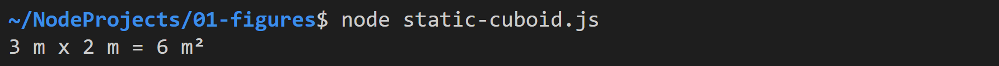
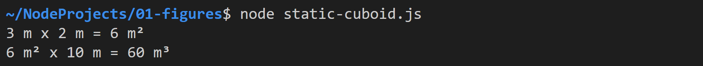
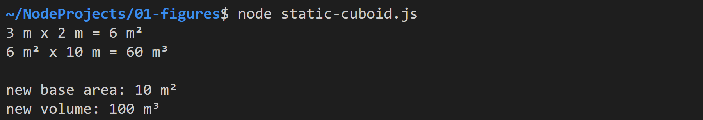
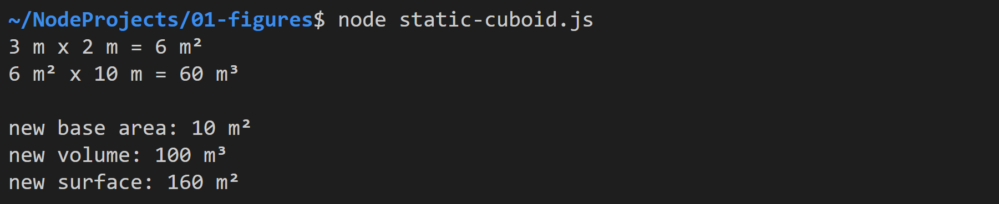
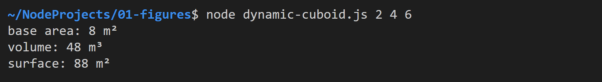
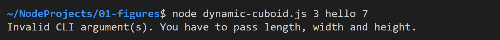

# Figures

Kompilieren Sie ohne die TypeScript-Datei oder den `target` Parameter anzugeben. Die notwendigen Einstellungen befinden sich bereits in der Datei `tsconfig.json`. 

Es reicht also folgenden Befehl im Terminal einzugeben: 

```bash
tsc
```

## Task 1: Rectangle

Erstellen Sie die Datei `static-cuboid.ts`. Fügen Sie darin zunächst den folgenden Code ein, um Namenskonflikte bei Variablennamen zu vermeiden:

```typescript
export { };
```

Deklarieren Sie anschließend das folgende Interface:

```typescript
interface Rectangle {
    length: number;
    width: number;
    area: () => number;
};
```

Erstellen Sie nun ein Rechteck mit Länge `3` und Breite `2`. Die Fläche soll in der Methode `area()` mithilfe der Properties `length` und `width` berechnet werden. 

Fügen Sie am Programmende folgende Ausgabe ein:

```typescript
console.log(`${rectangle.length} m x ${rectangle.width} m = ${rectangle.area()} m²`);
```

Dieser erzeugt folgende Ausgabe:



## Task 2: Cuboid

Deklarieren Sie unterhalb des Interfaces `Rectangle` das folgende Interface:

```typescript
interface Cuboid {
    base: Rectangle;
    height: number;
    volume: () => number;
}
```

Erstellen Sie einen Quader mit dem vorhandenen Rechteck-Objekt als Grundfläche und der Höhe `10`. Verwenden Sie in der Methode `volume()` die Funktion `this.base.area()`.

Geben Sie das Volumen wie unten abgebildet aus:



## Task 3: Adjusted Cuboid

Weisen Sie am Dateiende der Grundfläche des Quaders eine neue Länge von 5 zu. Geben Sie anschließend die neue Grundfläche und das neue Volumen aus:



## Task 4: Extended Cuboid

Erweitern Sie das Interface `Cuboid` um die **optionale** Methode `surface()`, welche die Quaderoberfläche berechnet. Implementieren Sie die Methode in ihrem Quader-Objekt und rufen Sie die Methode am Programmende auf.



**Hinweis:** Da die Methode optional ist, müssen sei vor deren Aufruf sicherstellen, dass sie nicht `undefined` ist.

## Task 5: Dynamic Cuboid

Erstellen Sie die Datei `dynamic-cuboid.ts`. Fügen Sie darin alle Interfaces und Objekte aus `static-cuboid.ts` mittels *Copy & Paste* ein. 

Ändern Sie das Interface `Cuboid`, so dass die Methode `surface()` nicht mehr optional ist.

Passen Sie anschließend die Objekte in `dynamic-cuboid.ts` so an, dass für die Länge, Breite und Höhe die ersten drei Argumente verwendet werden, die dem Programm beim Aufruf übergeben werden.

Die Ausgabe sollte (abhängig von den CLI-Argumenten) folgendermaßen aussehen:



**Hinweis:** Die Argumente müssen selbstverständlich in Zahlen umgewandelt werden!

## Task 6: Error Handling

Überprüfen Sie vor der Zuweisung der CLI-Argumente an die Objekte, ob diese erfolgreich in Zahlen umgewandelt wurden. Falls nein, soll folgende Fehlermeldung ausgegeben und das Programm abgebrochen werden:


